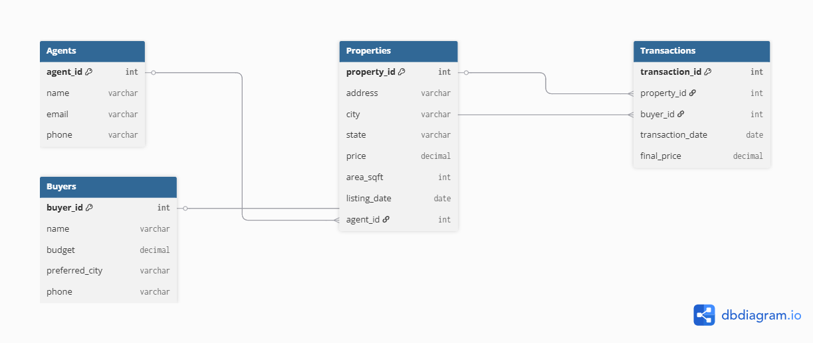

# 🏠 EstateTrack – Real Estate Listings & Analytics

## 📌 Overview
EstateTrack is a PostgreSQL-based system to manage real estate data and perform analytics like average property prices, high-demand cities, and price trends.

---

## 🛠️ Tools Used
- PostgreSQL (Database)
- DBeaver (GUI for DB and exports)
- SQL (Queries, Views, Reports)

---

## 📊 Features
- Manage properties, agents, buyers, and transactions
- Average price by region
- High-demand area view
- Price trends using SQL window functions
- Export results as CSV

---

## 🗂️ ER Diagram

The system includes 4 main entities and their relationships:

- **Agents** → lists → **Properties**  
- **Buyers** → makes → **Transactions**  
- **Properties** → sold in → **Transactions**

📷 **  

---

